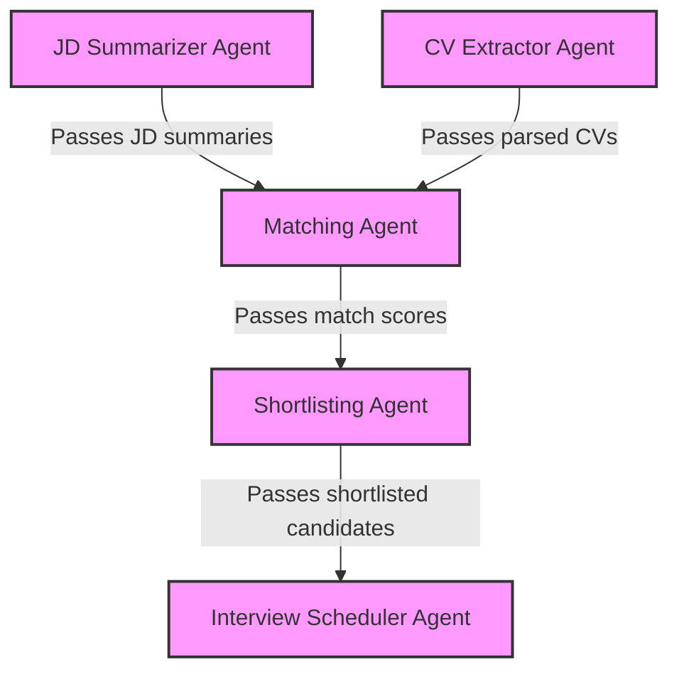

# Agent Interaction Diagram

```mermaid

graph TD
    A[JD Summarizer Agent] -->|Passes JD summaries| C[Matching Agent]
    B[CV Extractor Agent] -->|Passes parsed CVs| C
    C -->|Passes match scores| D[Shortlisting Agent]
    D -->|Passes shortlisted candidates| E[Interview Scheduler Agent]
    
    classDef agent fill:#f9f,stroke:#333,stroke-width:2px;
    class A,B,C,D,E agent;
    
```